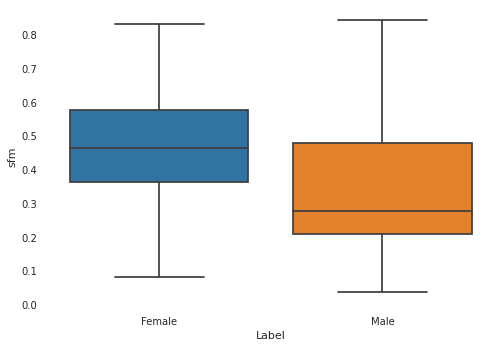
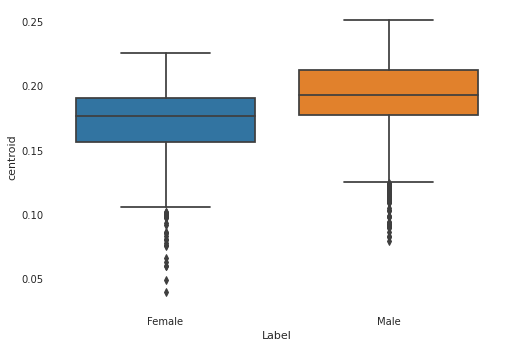
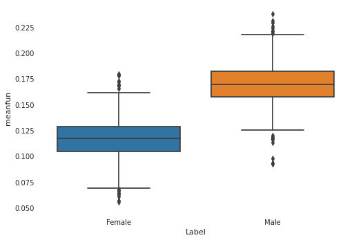
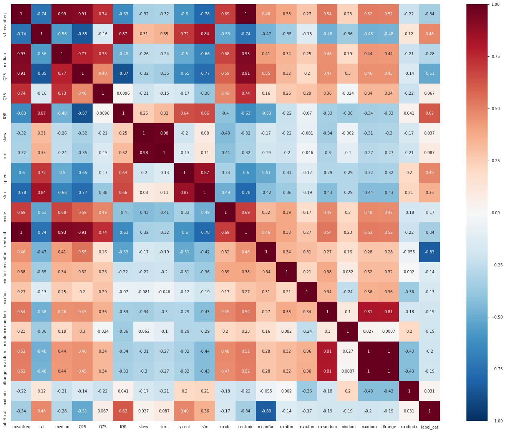
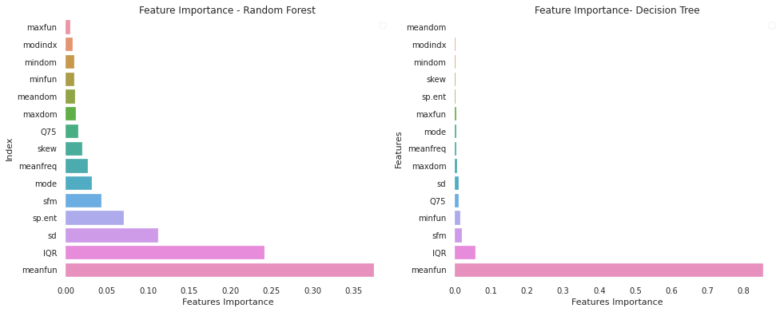
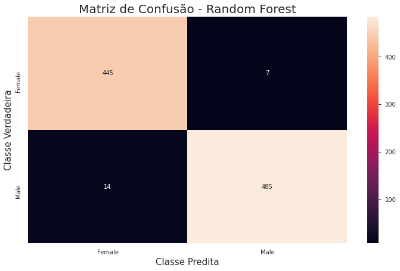

% Gender Recognition by Voice
% Matheus Jericó Palhares 
% 30 de Junho de 2020

---

# Sumário

1. Conjunto de Dados
1. Bibliotecas
1. Leitura dos Dados
1. Análise Exploratória
1. Processamento dos Dados
1. Separação dos Dados
1. Machine Learning
1. Métricas
1. Conclusão 

---

### 1. Conjunto de Dados

[Gender Recognition by Voice](https://www.kaggle.com/primaryobjects/voicegender)

#### 1.1. Resolução

Para resolução do problema proposto, utilizamos algoritmos de aprendizagem supervisionada. Utilizando o framework Scikit-learn para construção dos algorítmos de aprendizagem supervisionada.

---

### 2. Bibliotecas

- **Pandas**: Importar o dataset e realizar manipulações com dataframe.
- **Numpy**: Manipular conjunto de dados e trabalhar com métodos matemáticos.
- **Matplotlib** e **Seaborn**: Construção e visualização gráfica.
- **Scikit-learn**: Aplicar técnicas de normalização e padronização dos dados. Dividir os dados em treinamento, validação e teste. Calcular das métricas de validação dos algorítmos. Criar e treinar modelos de aprendizagem supervisionada.
- **XGBoost**: Criar e treinar o algorítmo GXBoosting.

---

### 3. Leitura dos Dados:

- Dataset não possui valores NaN;
- 20 variáveis;
- Label é a coluna target;
- Todos as variáveis independentes são numéricas.

---

### 4. Análise Exploratória

#### 4.1. Distribuição dos Dados com base na Classe
```
Distribuição das classificações dos dados:
Male: 50.0%.
Female: 50.0%.
```

**Análise**: <br>

- O dataset é balanceado e pré processado.

---

#### 4.2. Existe diferência entre as vozes masculinas e femininas?


- Classe Masculina:


<div>
<table border="1" class="dataframe">
  <thead>
    <tr style="text-align: right;">
      <th></th>
      <th>meanfreq</th>
      <th>sd</th>
      <th>median</th>
      <th>Q25</th>
      <th>Q75</th>
      <th>IQR</th>
      <th>skew</th>
      <th>kurt</th>
      <th>sp.ent</th>
      <th>sfm</th>
      <th>mode</th>
      <th>centroid</th>
      <th>meanfun</th>
      <th>minfun</th>
      <th>maxfun</th>
      <th>meandom</th>
      <th>mindom</th>
      <th>maxdom</th>
      <th>dfrange</th>
      <th>modindx</th>
    </tr>
  </thead>
  <tbody>
    <tr>
      <th>count</th>
      <td>1584.000000</td>
      <td>1584.000000</td>
      <td>1584.000000</td>
      <td>1584.000000</td>
      <td>1584.000000</td>
      <td>1584.000000</td>
      <td>1584.000000</td>
      <td>1584.000000</td>
      <td>1584.000000</td>
      <td>1584.000000</td>
      <td>1584.000000</td>
      <td>1584.000000</td>
      <td>1584.000000</td>
      <td>1584.000000</td>
      <td>1584.000000</td>
      <td>1584.000000</td>
      <td>1584.000000</td>
      <td>1584.000000</td>
      <td>1584.000000</td>
      <td>1584.000000</td>
    </tr>
    <tr>
      <th>mean</th>
      <td>0.170813</td>
      <td>0.065110</td>
      <td>0.175299</td>
      <td>0.115562</td>
      <td>0.226346</td>
      <td>0.110784</td>
      <td>3.295460</td>
      <td>48.331698</td>
      <td>0.917188</td>
      <td>0.471670</td>
      <td>0.152022</td>
      <td>0.170813</td>
      <td>0.115872</td>
      <td>0.034175</td>
      <td>0.253836</td>
      <td>0.728877</td>
      <td>0.040307</td>
      <td>4.358447</td>
      <td>4.318139</td>
      <td>0.177430</td>
    </tr>
    <tr>
      <th>std</th>
      <td>0.026254</td>
      <td>0.009455</td>
      <td>0.037392</td>
      <td>0.031999</td>
      <td>0.024050</td>
      <td>0.020415</td>
      <td>5.135190</td>
      <td>163.115940</td>
      <td>0.028938</td>
      <td>0.150473</td>
      <td>0.084024</td>
      <td>0.026254</td>
      <td>0.017179</td>
      <td>0.015749</td>
      <td>0.036003</td>
      <td>0.445997</td>
      <td>0.049199</td>
      <td>3.000285</td>
      <td>3.000605</td>
      <td>0.130132</td>
    </tr>
    <tr>
      <th>min</th>
      <td>0.039363</td>
      <td>0.041747</td>
      <td>0.010975</td>
      <td>0.000240</td>
      <td>0.042946</td>
      <td>0.021841</td>
      <td>0.326033</td>
      <td>2.068455</td>
      <td>0.786650</td>
      <td>0.080963</td>
      <td>0.000000</td>
      <td>0.039363</td>
      <td>0.055565</td>
      <td>0.010953</td>
      <td>0.103093</td>
      <td>0.007812</td>
      <td>0.004883</td>
      <td>0.007812</td>
      <td>0.000000</td>
      <td>0.000000</td>
    </tr>
    <tr>
      <th>25%</th>
      <td>0.155625</td>
      <td>0.058957</td>
      <td>0.149952</td>
      <td>0.101205</td>
      <td>0.211918</td>
      <td>0.100960</td>
      <td>1.461931</td>
      <td>5.003020</td>
      <td>0.899557</td>
      <td>0.363316</td>
      <td>0.098914</td>
      <td>0.155625</td>
      <td>0.104171</td>
      <td>0.017719</td>
      <td>0.246154</td>
      <td>0.399170</td>
      <td>0.007812</td>
      <td>1.759766</td>
      <td>1.751953</td>
      <td>0.099184</td>
    </tr>
    <tr>
      <th>50%</th>
      <td>0.176343</td>
      <td>0.061781</td>
      <td>0.180612</td>
      <td>0.122315</td>
      <td>0.228117</td>
      <td>0.109940</td>
      <td>1.880420</td>
      <td>6.970088</td>
      <td>0.917309</td>
      <td>0.461636</td>
      <td>0.157557</td>
      <td>0.176343</td>
      <td>0.117254</td>
      <td>0.036166</td>
      <td>0.271186</td>
      <td>0.686687</td>
      <td>0.023438</td>
      <td>4.457031</td>
      <td>4.429688</td>
      <td>0.139904</td>
    </tr>
    <tr>
      <th>75%</th>
      <td>0.190593</td>
      <td>0.070915</td>
      <td>0.202362</td>
      <td>0.136044</td>
      <td>0.244819</td>
      <td>0.119331</td>
      <td>2.645467</td>
      <td>12.282596</td>
      <td>0.936048</td>
      <td>0.576902</td>
      <td>0.228117</td>
      <td>0.190593</td>
      <td>0.128236</td>
      <td>0.047572</td>
      <td>0.277457</td>
      <td>1.032536</td>
      <td>0.031250</td>
      <td>6.035156</td>
      <td>6.000000</td>
      <td>0.212205</td>
    </tr>
    <tr>
      <th>max</th>
      <td>0.225582</td>
      <td>0.096030</td>
      <td>0.248840</td>
      <td>0.226740</td>
      <td>0.268924</td>
      <td>0.196168</td>
      <td>34.537488</td>
      <td>1271.353628</td>
      <td>0.981997</td>
      <td>0.831347</td>
      <td>0.280000</td>
      <td>0.225582</td>
      <td>0.179051</td>
      <td>0.121212</td>
      <td>0.279070</td>
      <td>2.805246</td>
      <td>0.458984</td>
      <td>21.867188</td>
      <td>21.843750</td>
      <td>0.932374</td>
    </tr>
  </tbody>
</table>
</div>


- Classe Feminina:


<div>
<table border="1" class="dataframe">
  <thead>
    <tr style="text-align: right;">
      <th></th>
      <th>meanfreq</th>
      <th>sd</th>
      <th>median</th>
      <th>Q25</th>
      <th>Q75</th>
      <th>IQR</th>
      <th>skew</th>
      <th>kurt</th>
      <th>sp.ent</th>
      <th>sfm</th>
      <th>mode</th>
      <th>centroid</th>
      <th>meanfun</th>
      <th>minfun</th>
      <th>maxfun</th>
      <th>meandom</th>
      <th>mindom</th>
      <th>maxdom</th>
      <th>dfrange</th>
      <th>modindx</th>
    </tr>
  </thead>
  <tbody>
    <tr>
      <th>count</th>
      <td>1584.000000</td>
      <td>1584.000000</td>
      <td>1584.000000</td>
      <td>1584.000000</td>
      <td>1584.000000</td>
      <td>1584.000000</td>
      <td>1584.000000</td>
      <td>1584.000000</td>
      <td>1584.000000</td>
      <td>1584.000000</td>
      <td>1584.000000</td>
      <td>1584.000000</td>
      <td>1584.000000</td>
      <td>1584.000000</td>
      <td>1584.000000</td>
      <td>1584.000000</td>
      <td>1584.000000</td>
      <td>1584.000000</td>
      <td>1584.000000</td>
      <td>1584.000000</td>
    </tr>
    <tr>
      <th>mean</th>
      <td>0.191000</td>
      <td>0.049142</td>
      <td>0.195942</td>
      <td>0.165349</td>
      <td>0.223184</td>
      <td>0.057834</td>
      <td>2.984875</td>
      <td>24.805224</td>
      <td>0.873066</td>
      <td>0.344763</td>
      <td>0.178541</td>
      <td>0.191000</td>
      <td>0.169742</td>
      <td>0.039429</td>
      <td>0.263848</td>
      <td>0.929544</td>
      <td>0.064987</td>
      <td>5.736107</td>
      <td>5.671120</td>
      <td>0.170073</td>
    </tr>
    <tr>
      <th>std</th>
      <td>0.029960</td>
      <td>0.018380</td>
      <td>0.032149</td>
      <td>0.049767</td>
      <td>0.023121</td>
      <td>0.042924</td>
      <td>3.091454</td>
      <td>97.669114</td>
      <td>0.047288</td>
      <td>0.179854</td>
      <td>0.067175</td>
      <td>0.029960</td>
      <td>0.018460</td>
      <td>0.021845</td>
      <td>0.021529</td>
      <td>0.576884</td>
      <td>0.072739</td>
      <td>3.854042</td>
      <td>3.856124</td>
      <td>0.107639</td>
    </tr>
    <tr>
      <th>min</th>
      <td>0.078847</td>
      <td>0.018363</td>
      <td>0.035114</td>
      <td>0.000229</td>
      <td>0.127637</td>
      <td>0.014558</td>
      <td>0.141735</td>
      <td>2.209673</td>
      <td>0.738651</td>
      <td>0.036876</td>
      <td>0.000000</td>
      <td>0.078847</td>
      <td>0.091912</td>
      <td>0.009775</td>
      <td>0.163934</td>
      <td>0.007812</td>
      <td>0.004883</td>
      <td>0.007812</td>
      <td>0.000000</td>
      <td>0.000000</td>
    </tr>
    <tr>
      <th>25%</th>
      <td>0.177031</td>
      <td>0.034977</td>
      <td>0.181021</td>
      <td>0.157892</td>
      <td>0.206280</td>
      <td>0.031106</td>
      <td>1.962717</td>
      <td>6.764500</td>
      <td>0.839784</td>
      <td>0.208125</td>
      <td>0.168883</td>
      <td>0.177031</td>
      <td>0.157395</td>
      <td>0.019116</td>
      <td>0.258065</td>
      <td>0.450566</td>
      <td>0.023438</td>
      <td>2.560547</td>
      <td>2.435547</td>
      <td>0.101201</td>
    </tr>
    <tr>
      <th>50%</th>
      <td>0.192732</td>
      <td>0.041965</td>
      <td>0.198226</td>
      <td>0.175373</td>
      <td>0.223744</td>
      <td>0.042689</td>
      <td>2.435808</td>
      <td>9.607635</td>
      <td>0.865861</td>
      <td>0.277228</td>
      <td>0.193670</td>
      <td>0.192732</td>
      <td>0.169408</td>
      <td>0.047013</td>
      <td>0.274286</td>
      <td>0.867405</td>
      <td>0.023438</td>
      <td>6.042969</td>
      <td>5.964844</td>
      <td>0.138995</td>
    </tr>
    <tr>
      <th>75%</th>
      <td>0.211981</td>
      <td>0.060452</td>
      <td>0.216214</td>
      <td>0.195243</td>
      <td>0.241486</td>
      <td>0.061268</td>
      <td>3.086396</td>
      <td>14.448639</td>
      <td>0.908557</td>
      <td>0.478122</td>
      <td>0.218152</td>
      <td>0.211981</td>
      <td>0.181832</td>
      <td>0.048534</td>
      <td>0.277457</td>
      <td>1.338521</td>
      <td>0.140625</td>
      <td>8.607422</td>
      <td>8.531250</td>
      <td>0.201557</td>
    </tr>
    <tr>
      <th>max</th>
      <td>0.251124</td>
      <td>0.115273</td>
      <td>0.261224</td>
      <td>0.247347</td>
      <td>0.273469</td>
      <td>0.252225</td>
      <td>34.725453</td>
      <td>1309.612887</td>
      <td>0.978482</td>
      <td>0.842936</td>
      <td>0.280000</td>
      <td>0.251124</td>
      <td>0.237636</td>
      <td>0.204082</td>
      <td>0.279114</td>
      <td>2.957682</td>
      <td>0.449219</td>
      <td>21.796875</td>
      <td>21.773438</td>
      <td>0.857764</td>
    </tr>
  </tbody>
</table>
</div>

---

:::::::::::::: {.columns}
::: {.column width="50%"}

#### 4.3. 1º quartil em KHz (Q25)


:::
::: {.column width="50%"}

#### 4.4. Planicidade Espectral (sfm)



:::
::::::::::::::

:::::::::::::: {.columns}
::: {.column width="50%"}

#### 4.5. Centróide de Frequência (centroid)



:::
::: {.column width="50%"}

#### 4.6.  Média da Frequência dominante (meanfun)



:::
::::::::::::::

---

#### 4.7. Transformação da Label
- Label Encoder

<div>
<table border="1" class="dataframe">
  <thead>
    <tr style="text-align: right;">
      <th></th>
      <th>label</th>
      <th>label_cat</th>
    </tr>
  </thead>
  <tbody>
    <tr>
      <th>1156</th>
      <td>male</td>
      <td>1</td>
    </tr>
    <tr>
      <th>3166</th>
      <td>female</td>
      <td>0</td>
    </tr>
    <tr>
      <th>1018</th>
      <td>male</td>
      <td>1</td>
    </tr>
    <tr>
      <th>2149</th>
      <td>female</td>
      <td>0</td>
    </tr>
    <tr>
      <th>1527</th>
      <td>male</td>
      <td>1</td>
    </tr>
  </tbody>
</table>
<p>5 rows × 22 columns</p>
</div>

---

#### 4.7. Correlação entre as variáveis


---

#### 4.8. Feature Importance

Para analisar as features mais relevantes para problema de reconhecimento de voz, utilizamos dois algoritmos do método Ensemble. 

{width=80% height=80%}
    
Entre os dois algoritmos, tivemos pouca divergência. Entretando, considerei o resultado das features mais importantes do algoritmo **Random Forest**, pois o mesmo pondera mais variáveis para tomada de decisão.

---

### 5. Processamento dos dados

#### 5.1. Removendo Multicolinearidade
- Multicolinearidade reduz a performace dos algorítmos de ML.
- Remoção das variáveis independentes com correlação superior a 0.9.
```
(3168, 16)
```

#### 5.2. Removendo as Features com Menor Importância
Após analisar a análise de *feature importance*, removemos as 5 features com menor importância para redução na quantidade de dados.
```
Features com menor importância: ['maxfun', 'modindx', 'mindom', 'minfun', 'meandom']
```
```
(3168, 11)
```

---

#### 6. Separando dados de treino e teste
- Utilizando o framework Scikit-Learn para separar os dados:
  - 70% para treino.
  - 30% para teste.

---

### 7. Machine Learning


:::::::::::::: {.columns}
::: {.column width="50%"}

#### 7.1. Métodos Ensemble 


Fonte: Global Software

:::
::: {.column width="50%"}

#### 7.2. SVM 


Fonte: Scikit Learn

:::
::::::::::::::


---

#### 7.3. Seleção de Algorítmos utilizando Validação Cruzada
Comparamos o desempenho dos Algorítmos: *Logistic Regression, Naive Bayes, Decision Tree, Random Forest, XGBoosting, Gradient Boosting*.
```
    Nome do Modelo                | Acurácia Média  | Desvio Padrão
    Logistic Regression                  96.81%          0.13%
    Naive Bayes                          93.69%          0.65%
    Decision Tree                        96.93%          0.16%
    Random Forest                        97.92%          0.38%
    XGB Classifier                       97.97%          0.69%
    Gradient Boosting Classifier         97.78%          0.77%
    SVM                                  97.92%          0.27%
```

**Análise**:<br>

- Selecionei os seguintes modelos:
  - SVM;
  - Random Forest;
  - XGB Classifier;
  - Logistic Regression.

---

#### 7.4. GridSearch e Validação
- Utilizamos a métrica de Acurácia para otimizar os hiperparâmetros dos Algorítmos de Aprendizagem Supervisionada.

---

##### 7.4.1. Logistic Regression

Parâmetros escolhidos para tunning:<br>

- Solver: 'liblinear' e 'lbfgs';
- C: '10' e '25'.

```
              precision    recall  f1-score   support

           0       0.97      0.97      0.97       452
           1       0.97      0.97      0.97       499

    accuracy                           0.97       951
   macro avg       0.97      0.97      0.97       951
weighted avg       0.97      0.97      0.97       951

------------------------------------------------------
[[437  15]
 [ 13 486]]
------------------------------------------------------
LogisticRegression accuracy: 0.9705573080967402
```

---

##### 7.4.2. SVM
Parâmetros escolhidos para tunning:<br>

- C: '0.1', '1', '10' e '100'; 
- gamma: '1', '0.1', '0.01' e '0.001';
- kernel: 'rbf', 'poly' e 'sigmoid'

```
              precision    recall  f1-score   support

           0       0.97      0.98      0.98       452
           1       0.98      0.98      0.98       499

    accuracy                           0.98       951
   macro avg       0.98      0.98      0.98       951
weighted avg       0.98      0.98      0.98       951

------------------------------------------------------
[[444   8]
 [ 12 487]]
------------------------------------------------------
SVM accuracy: 0.9789695057833859
```

---

##### 7.4.3. XGB Classifier
Parâmetros escolhidos para tunning:<br>

- Learning Rate: '0.01' e '0.15';
- Max depth: '15', '25' e '50';
- Number estimators: '50', '100' e '200'.

```
              precision    recall  f1-score   support

           0       0.97      0.99      0.98       452
           1       0.99      0.97      0.98       499

    accuracy                           0.98       951
   macro avg       0.98      0.98      0.98       951
weighted avg       0.98      0.98      0.98       951

------------------------------------------------------
[[446   6]
 [ 16 483]]
------------------------------------------------------
XGBClassifier accuracy: 0.9768664563617245
```

---

##### 7.4.4 Random Forest Classifier
Parâmetros escolhidos para tunning:<br>

- Max depth: '15', '25' e '50';
- Number estimators: '50', '100' e '200'.

```
              precision    recall  f1-score   support

           0       0.97      0.98      0.98       452
           1       0.99      0.97      0.98       499

    accuracy                           0.98       951
   macro avg       0.98      0.98      0.98       951
weighted avg       0.98      0.98      0.98       951

------------------------------------------------------
[[445   7]
 [ 14 485]]
------------------------------------------------------
RandomForestClassifier accuracy: 0.9779179810725552
```

---

### 8. Métricas

#### 8.1. ROC AUC
```
Métrica ROC AUC:
Logistic Regression:           97.04%
SVM:                           97.91%
XGB Classifier:                97.7%
Random Forest Classifier:      97.8%
```
**Análise**: <br>

- Os quatro algoritmos tiverem resultados muito semelhantes.


---

#### 8.2. Precision
```
Métrica Precisão (Precision):
Logistic Regression:           97.00999999999999%
SVM:                           98.38%
XGB Classifier:                98.8%
Random Forest Classifier:      98.58%
```
**Análise**: <br>

- Os quatro algoritmos tiveram resultados muito semelhantes.


---

#### 8.3. Recall
```
Métrica Revocação (Recall):
Logistic Regression:           97.39%
SVM:                           97.6%
XGB Classifier:                96.8%
Random Forest Classifier:      97.2%
```
**Análise**: <br>

- Os quatro algorítmos tiveram resultados muito semelhantes.


---

#### 8.4. F1-Score
```
Métrica F1-Score:
Logistic Regression:           97.2%
SVM:                           98.0%
XGB Classifier:                97.8%
Random Forest Classifier:      97.88%
```
**Análise**: <br>

- Os quatro algoritmos tiveram resultados muito semelhantes

---

#### 8.5. Acurácia
```
Métrica Accuracy:
Logistic Regression:           97.06%
SVM:                           97.89999999999999%
XGB Classifier:                97.7%
Random Forest Classifier:      97.8%
```
**Análise**: <br>

- Os quatro algoritmos tiveram resultados muito semelhantes

---

#### 8.6. Matriz de Confusão (SVM)
Vamos analisar a matriz de confusão do algoritmo que obteve melhor desempenho.



---

### 9. CONCLUSÃO

- Após aplicar algorítmos de Aprendizagem Supervisionada, podemos concluir com base nas métricas que o desempenho dos algorítmos são semelhantes.
- Como a comparação das métricas dos algorítmos são muito semelhantes, podemos concluir que esse é um problema relativamente fácil de resolver. As vozes masculinas e femininas possuem características muito distintas.
- O SVM obteve a melhor performace utilizando a métrica de Acurácia.

---

- Mini Projeto Transfer Learning <br>
[https://github.com/matheusjerico/transfer-learning-cnn-resnet](https://github.com/matheusjerico/transfer-learning-cnn-resnet)

- Mini Projeto Sentiment Analysis <br>
[https://github.com/matheusjerico/sentiment-analysis-bert-pytorch](https://github.com/matheusjerico/sentiment-analysis-bert-pytorch)

- Mini Projeto Style Transfer <br>
[https://github.com/matheusjerico/style-transfer-pytorch](https://github.com/matheusjerico/style-transfer-pytorch)

- Projeto Final <br>
[https://github.com/matheusjerico/gender-voice-classification](https://github.com/matheusjerico/gender-voice-classification)